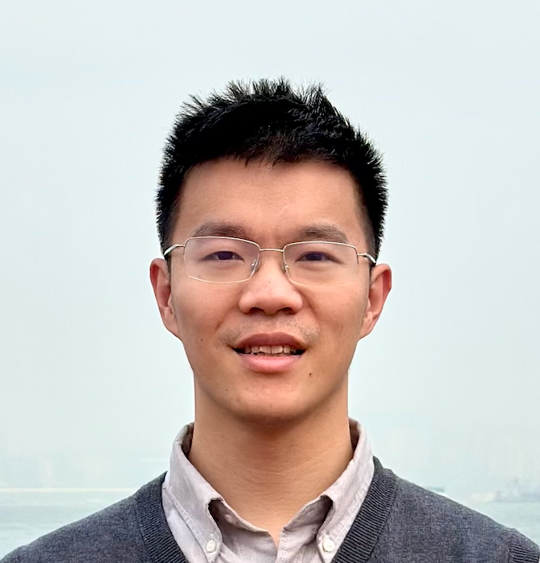

> 原文：[Notion 原文](https://pengsida.notion.site/471320ccf3a04e2eba052c6514e9b982) · 作者可能已更新，以原文为准。

## Sida Peng (彭思达)

> 该页面主要用于分享在Notion上的开源学习笔记

[Homepage](https://pengsida.net/)
[GitHub](https://github.com/pengsida/)   
[Google Scholar](https://scholar.google.com/citations?user=l9NCksYAAAAJ&hl=en)  
Short Bio
I am an assistant professor (ZJU-100 Young Professor) at Zhejiang University. I received my Ph.D. degree from College of Computer Science and Technology at Zhejiang University in 2023, supervised by Prof. Xiaowei Zhou and Prof. Hujun Bao, and obtained my bachelor degree in Information Engineering from Zhejiang University in 2018. I received the [2024 CCF Outstanding Doctoral Dissertation Award](https://mp.weixin.qq.com/s/a8RQ8FCwMKoDXwjjXJ7v1g) and was selected as the [2022 Apple Scholar in AI/ML](https://machinelearning.apple.com/updates/apple-scholars-aiml-2022).
I work closely with Prof. Xiaowei Zhou. We are looking for students, postdocs and research assistants. Please [apply to our lab here](https://docs.qq.com/form/page/DZkxUcXRteEhnWktK) if you are interested in working with us.

---

#### 科研素养笔记
科研经验笔记：[https://github.com/pengsida/learning_research](https://github.com/pengsida/learning_research)
[博士生的楷模：Sebastian Starke](../others/qualities.md)
[从面试问题的角度反思科研的宝贵品质](../project/qualities-from-interview.md)
[自然科学的定义（数学与科学的区别）](../notes/science-definition.md)

---

#### 技术学习笔记
最近的技术学习笔记主要更新在小红书：[链接](https://www.xiaohongshu.com/user/profile/56daf09784edcd4fa92ef524)
更早的笔记：
[《深度强化学习》学习笔记](../notes/deep-rl.md)
[张祥雨访谈-多模态&AGI认知学习笔记](../notes/zhang-xiangyu.md)
[gpt4o相关技术学习笔记](../notes/gpt4o.md)
[3D LLM的pipeline总结](../notes/3d-llm.md)
[如何使用copilot和gpt辅助英语写作](../writing/copilot-english.md)
[具身智能的pipeline总结](../notes/embodied.md)
[Ross Girshick的talk笔记](../notes/ross-girshick.md)
[LeCun Talk笔记](../notes/lecun.md)

### 子页面

- [探索性实验应遵循最小可行性](../notes/minimal-viable.md)
- [Phase for Character Control](../others/phase.md)
